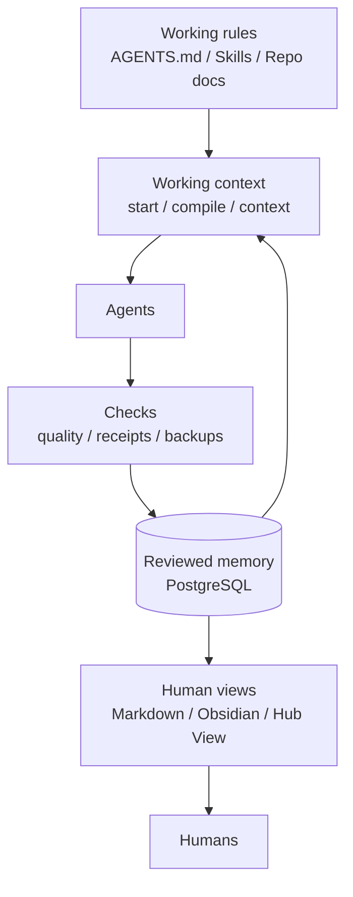

# Agent Data Hub

> verified context for humans and agents

Agent Data Hub is an early local-first technical preview for reviewed project
memory and disciplined agent work.

It is built for a simple problem: agents often work from scattered chats,
partial context, and stale assumptions. Agent Data Hub gives them a smaller,
reviewable starting point and gives humans a calmer way to inspect what is
actually known.

## What It Is

Agent Data Hub separates three things:

- **Memory**: reviewed project knowledge stored in PostgreSQL.
- **Working context**: the compact brief an agent starts from for one run.
- **Working rules**: repo-local instructions such as `AGENTS.md`, skills, and
  project documents.

The Hub stores curated facts, decisions, risks, open questions, reports, and
relations. It can export a human-readable Markdown projection and show the same
state in a small local read-only UI called Hub View.

## What It Is Not

Agent Data Hub is not:

- a raw chat log store
- a secret store
- an autonomous schema generator
- a hosted multi-user SaaS
- a replacement for repo-local working rules

It is a local reviewed context system with operational checks, backups, and
explicit project boundaries.

## Public Preview Status

This repository should currently be read as an **early local-first technical
preview**.

What is already real:

- a PostgreSQL-backed memory model
- start/finish wrappers for disciplined agent runs
- quality checks, receipts, and backup verification
- Markdown/Obsidian projection
- a local read-only Hub View

What is still rough:

- some scripts are tuned for the maintainer's own local workflow
- setup is local-operator oriented, not packaged for broad installation
- the demo path is narrower than the internal day-to-day path

## Architecture



## Public Quickstart

For a public smoke test, use the dedicated neutral demo path:

1. Create a local environment file from `.env.example`.
2. Start the public demo database path:

```bash
scripts/db_start_public_demo.sh
```

3. Run the end-to-end demo smoke:

```bash
scripts/smoke_public_demo.sh
```

4. Start the local read-only review UI:

```bash
scripts/hub_view.sh
```

Hub View is a local review surface, not the operational source of truth.

## Agent Workflow

The normal run rhythm is:

```bash
scripts/agent_start.sh --project <project-slug> --query "<current focus>" --review
# work inside one project boundary
scripts/agent_finish.sh --project <project-slug> --review
```

Write back only reviewed, non-sensitive memory:

```bash
scripts/project_remember.sh \
  --project <project-slug> \
  --type fact \
  --text "Reviewed project memory goes here." \
  --source "non-sensitive source"
```

If something useful does not fit an existing category, record a structure
question instead of forcing it into the wrong type:

```bash
scripts/project_schema_friction.sh \
  --project <project-slug> \
  --observed "This rule does not belong in durable memory." \
  --why "It may belong in AGENTS.md or a skill manifest." \
  --dry-run
```

## Human Views

Agent Data Hub can project reviewed memory into Markdown for human reading and
Obsidian graph navigation. It can also render the same project set in Hub View.

The human-facing surfaces are for:

- reading
- review
- graph navigation
- notes and handoff inspection

They are not the binding database. PostgreSQL remains the reviewed source of
truth.

## Safety Boundaries

Do not store these in the Hub:

- passwords
- API keys or tokens
- FTP credentials
- private customer data
- raw invoice data
- deployment secrets
- unreviewed claims
- cross-project assumptions

## Startup Paths

This repository now has two deliberately separate startup paths:

- `scripts/db_start_public_demo.sh`: neutral public demo path
- `scripts/db_start.sh`: maintainer local ops path

The public path is the recommended first experience for outside developers.
The maintainer path exists for the operator's own daily work and seeds real
local working data.

## Further Reading

- [Public overview](docs/public/agent-data-hub-overview.md)
- [Public getting started](docs/public/getting-started.md)
- [Agent workflow](docs/agent-workflow.md)
- [Code architecture](docs/code-architecture.md)
- [Schema notes](docs/schema-notes.md)
