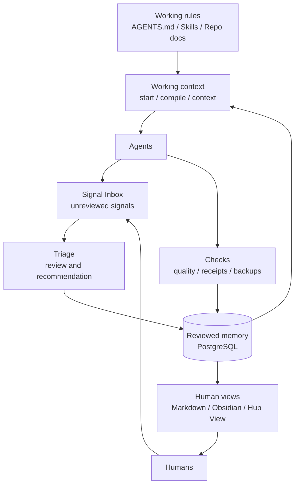

# Agent Data Hub

> verified context for humans and agents

Agent Data Hub is an early local-first technical preview for reviewed project
memory and disciplined agent work.

License: MIT.

It is built for a simple problem: agents often work from scattered chats,
partial context, and stale assumptions. Agent Data Hub gives them a smaller,
reviewable starting point and gives humans a calmer way to inspect what is
actually known.

## What It Is

Agent Data Hub separates three things:

- **Memory**: reviewed project knowledge stored in PostgreSQL.
- **Working context**: the compact brief an agent starts from for one run.
- **Working rules**: repo-local instructions such as `AGENTS.md`, skills, and
  project documents.

Useful signals that are not reviewed yet should stay outside the Hub in a
Signal Inbox until they are triaged.

The Hub stores curated facts, decisions, risks, open questions, reports, and
relations. It can export a human-readable Markdown projection and show the same
state in a small local review UI called Hub View. Hub View can also accept or
reject draft memory candidates as explicit, audited human review actions.

## What It Is Not

Agent Data Hub is not:

- a raw chat log store
- a secret store
- an autonomous schema generator
- a hosted multi-user SaaS
- a replacement for repo-local working rules

It is a local reviewed context system with operational checks, backups, and
explicit project boundaries.

The automation boundary is intentionally conservative: checks, exports,
receipts, backups, and read-only context can run automatically; triage may make
suggestions; Hub writeback stays reviewed; deployments, credentials,
destructive actions, and external publishing require explicit human approval.

## Public Preview Status

This repository should currently be read as an **early local-first technical
preview**.

What is already real:

- a PostgreSQL-backed memory model
- start/finish wrappers for disciplined agent runs
- quality checks, receipts, and backup verification
- Markdown/Obsidian projection
- a local Hub View for reading reviewed memory and reviewing drafts

What is still rough:

- some scripts are tuned for the maintainer's own local workflow
- packaging is still intentionally lightweight
- the demo path is narrower than the internal day-to-day path

## Architecture



## Public Quickstart

Requirements: Python 3.11+, Docker, and Docker Compose. Start Docker first.

For the neutral public demo, run one script:

```bash
git clone https://github.com/AlexanderSmyslowski/central-agent-data-hub.git
cd central-agent-data-hub
scripts/first_run_demo.sh
```

The script creates `.venv` if needed, installs or reuses the local CLI, creates
`.env` from `.env.example` if missing, starts the isolated public demo
database, runs the public demo check, then starts Hub View and prints the local
URL to open. It does not overwrite an existing `.env`.

In the first ten minutes, check only this path:

- open the printed Hub View URL
- open the demo project
- review the one neutral suggested memory change in Review Inbox
- prepare one agent handoff from the demo project
- run `scripts/db_doctor.sh --public-demo` if the demo Hub appears offline

The one-command path uses `demo-reviewer` only for local demo attribution; this
is not authentication and is not written to `.env`.

For a step-by-step walkthrough, see
[`docs/public/first-run-demo-session.md`](docs/public/first-run-demo-session.md).

Other first-run modes:

```bash
scripts/first_run_demo.sh --no-hub-view
scripts/first_run_demo.sh --mobile
```

Mobile preview is for reading and orientation on a trusted Wi-Fi or local
network; Hub View disables Review Inbox and Codex setup writes when it is not
bound to loopback. Direct non-loopback Hub View starts require
`--allow-lan-read`.

Troubleshooting:

```bash
scripts/db_doctor.sh --public-demo
```

Hub View is a local review surface, not the operational source of truth. The
interface can be switched between English and German; stored memory stays in
its original language.

## After The Demo: Daily Local Use

The public demo proves the shape. Daily use starts when you register a real
local project, install or copy the repo-local agent rule, and run one reviewed
work loop:

```bash
scripts/register_project.sh --repo /path/to/project --slug <project-slug> --name "Project Name"
scripts/agent_start.sh --project <project-slug> --query "<current focus>" --review
# work inside that project boundary
scripts/agent_finish.sh --project <project-slug> --review
```

Use Hub View as the local human workbench: inspect reviewed memory, review
drafts, and prepare visible agent handoffs. Use the CLI/MCP paths for exact
agent automation. See
[`docs/public/daily-use.md`](docs/public/daily-use.md) for the canonical daily
workflow.

## Agent Workflow

Hub View can make the agent handoff visible from the UI. Open a project, use
**Connect an agent**, enter the task, and click **Prepare agent handoff**. The
generated view starts with **Connect your agent**: choose the agent you
use, follow the matching setup card, then check the handoff. It shows which
reviewed facts, decisions, risks, questions, reports, and trail entries would
be handed to a chatbot or local agent, plus how that context should influence
the work.

For chatbots, the practical path is copy and paste. For local agents, the
better path is one-time connection: configure the agent to request ADH context
at task start through the read-only MCP surface or an equivalent startup rule.
Hub View separates setup paths for Claude Code, Codex, Hermes or custom startup
rules, and generic MCP-compatible agents. Claude Code gets a single copyable
setup command. Codex gets a guarded local setup action: when Hub View knows the
project folder, it previews the `AGENTS.md` block and can install it only after
an explicit local click. The copyable command remains available as a fallback.
Hermes/custom agents get a startup-rule block; other MCP clients get the config
shape.
The same page shows **Connection verification**: Codex can be checked against
the repo-local `AGENTS.md` block when the project folder is registered; other
agents remain honest manual checks in their own configuration.
The terminal start command remains useful as a manual fallback until the local
agent is connected, not as the intended long-term daily UX.

The normal run rhythm is:

```bash
scripts/agent_start.sh --project <project-slug> --query "<current focus>" --review
# work inside one project boundary
scripts/agent_finish.sh --project <project-slug> --review
```

`agent_start.sh` prints an **ADH Context Loaded** receipt before the detailed
memory sections. The receipt shows the project, task, reviewed-memory counts,
and the same influence rules shown in Hub View.

For a task-specific read-only context pack:

```bash
agent-hub prepare --project <project-slug> --task "review release readiness"
```

`prepare` turns reviewed memory into a concrete working brief for one task. It
does not write memory, import signals, or make decisions. The output includes a
Context Trail that lists included source item counts, IDs, status, task scores,
review status, and inclusion reasons. Drafts may appear in a separate review
section, clearly marked as unconfirmed. `--task` ranks facts, decisions, and
reports with deterministic PostgreSQL full-text search, then fills with recent
reviewed context. Active risks and open questions remain on a safety floor and
are not filtered out by task text.

`prepare` also includes a compact **Known Gaps** section. It can show stale
items, unanswered questions, empty memory types, task blind spots, and pending
drafts. These are read-only labels in the context pack. A stale reviewed item
stays reviewed; there is no silent demotion, re-review, or automatic action.
The default stale threshold is 42 days and can be changed with:

```bash
agent-hub prepare --project <project-slug> --task "review release" --stale-after-days 60
```

## MCP (Read-Only)

Agent Data Hub can expose reviewed context to MCP-capable agents over stdio:

```bash
pip install -e ".[mcp]"
agent-hub mcp-serve
```

The MCP server is deliberately read-only. It can list projects, build the same
JSON context pack as `agent-hub prepare --format json`, search reviewed memory,
and return the compact `agent-hub brief --format json` shape. It cannot
remember, import, accept, reject, sync, or modify memory.

For stdio MCP, the local agent normally launches `agent-hub mcp-serve` when it
needs context. Hub View can show the setup and the context handoff, but ADH does
not silently inject context into an unconfigured agent. A local agent must be
configured once; after that, the agent is instructed to request ADH context at
the start of each ADH-related task.

Example Claude Code setup from this checkout:

```bash
claude mcp add agent-data-hub -- agent-hub mcp-serve
```

Equivalent `.mcp.json` shape:

```json
{
  "mcpServers": {
    "agent-data-hub": {
      "command": "agent-hub",
      "args": ["mcp-serve"]
    }
  }
}
```

Generic stdio clients should launch `agent-hub mcp-serve` with `DATABASE_URL`
set for the local Hub database. Writes stay behind the CLI and Hub View review
paths, where the human review gate is explicit.

## OKF Export Preview

Agent Data Hub can export reviewed project memory as a small
[Open Knowledge Format](https://github.com/GoogleCloudPlatform/knowledge-catalog/blob/main/okf/SPEC.md)
preview bundle:

```bash
agent-hub export-okf --project <project-slug> --out .local/okf/<project-slug>
```

The OKF export is read-only and deterministic. It writes Markdown files with
YAML frontmatter for reviewed facts, accepted decisions, active risks, open or
answered questions, and published reports. Drafts, proposed items, archived
items, rejected decisions, resolved risks, and superseded reports are excluded.
This is an export target, not a second source of truth or an import/sync layer.
Use a fresh output directory for preview exports. The command overwrites
generated paths, but it does not remove stale files that may remain from an
older bundle.

Submit only sourced, non-sensitive memory candidates:

```bash
scripts/project_remember.sh \
  --project <project-slug> \
  --type fact \
  --text "Reviewed project memory goes here." \
  --source "non-sensitive source"
```

The wrapper applies the same routing as the CLI. Ordinary candidates become
drafts; sensitive or contradictory candidates require review first.

## Drafts and Review Inbox

New memory candidates are routed before they touch reviewed memory:

- `auto`: reversible evidence such as receipts, audit records, or same-source
  refreshes of an existing reviewed item
- `ask`: money amounts, secret or credential patterns, customer-data hints,
  deletion intent, or contradictions with existing reviewed memory
- `draft`: ordinary unreviewed candidates

Drafts are stored with status `draft` and remain outside reviewed memory until a
human explicitly accepts them. The draft status is supported for facts,
decisions, risks, open questions, and reports:

```bash
agent-hub inbox
agent-hub inbox --for alice
agent-hub inbox --accept <draft-id> --reviewer bob
agent-hub inbox --reject <draft-id> --reviewer bob
```

There is no time-based auto-accept and no silent promotion from draft to
reviewed memory.

Draft visibility is intentionally split by surface:

- agent-facing reads (`brief`, `compile`, `handoff`, `context`, MCP
  `project_brief`, and default `search`) exclude drafts and inactive memory
  statuses
- `search --include-drafts` can show unreviewed drafts, and
  `search --include-archived` can show archived or inactive statuses
- daily human summaries still show draft activity and include a
  `N drafts awaiting review (agent-hub inbox)` line
- Obsidian export keeps draft pages, adds `review_status: draft`, and marks
  them as unreviewed; compiled overview pages show only the draft count and
  inbox pointer, not draft items in the main reviewed lists

Agent Data Hub v0.1.x uses attribution instead of access control: everyone in
the trusted local workspace can see the review inbox, but every accept/reject
decision must carry a reviewer handle. This is not an authentication system.
Draft routing can suggest a responsible reviewer through
`--metadata assigned_reviewer=alice`, `projects.metadata.default_reviewer`, or a
local default, but it does not create permissions. Another reviewer can still
accept the draft; the audit records both handles.

## Integration Surface For External Review Adapters

External review adapters must import only `agent_hub.review_api`. The supported
functions are:

- `connect`
- `fetch_drafts`
- `review_draft_by_id`
- `validate_reviewer_handle`
- `resolve_responsible_reviewer`

Everything else in `agent_hub` is internal and may change without notice.
Review adapters may submit only registered `review_source` values; ADH currently
recognizes `cli`, `hub_view`, and `telegram`.

If something useful does not fit an existing category, record a structure
question instead of forcing it into the wrong type:

```bash
scripts/project_schema_friction.sh \
  --project <project-slug> \
  --observed "This rule does not belong in durable memory." \
  --why "It may belong in AGENTS.md or a skill manifest." \
  --dry-run
```

## Human Views

Agent Data Hub can project reviewed memory into Markdown for human reading and
Obsidian graph navigation. It can also render the same project set in Hub View.
Hub View is mostly read-only. Its only Hub-memory write actions are accepting or
rejecting one draft at a time through the Review Inbox. It may also install the
repo-local Codex `AGENTS.md` setup block after an explicit local click.

The human-facing surfaces are for:

- reading
- explicit draft review
- graph navigation
- notes and handoff inspection

They are not the binding database. PostgreSQL remains the reviewed source of
truth.

## Signal Inbox

Not every useful input belongs in reviewed memory immediately.

Agent Data Hub now documents a small Signal Inbox pattern for:

- X or Twitter research
- Gmail observations
- Hermes or Codex notes
- external links and screenshots

The Signal Inbox is a human-readable wiki folder outside PostgreSQL. Triage
decides whether a signal should be ignored, kept in the wiki, promoted to a
memory candidate, or treated as a skill or policy hint.

Initialize one with:

```bash
scripts/init_signal_inbox.sh --path /path/to/wiki/inbox/signals
```

That initializer now creates only a minimal root by default. Add a first source
file only when a real source needs one:

```bash
scripts/init_signal_inbox.sh --path /path/to/wiki/inbox/signals --scaffold-source x-research
```

## Safety Boundaries

Do not store these in the Hub:

- passwords
- API keys or tokens
- FTP credentials
- private customer data
- raw invoice data
- deployment secrets
- unreviewed claims
- cross-project assumptions

## Startup Paths

This repository now has two deliberately separate startup paths:

- `scripts/db_start_public_demo.sh`: neutral public demo path
- `scripts/db_start.sh`: maintainer local ops path

The public path is the recommended first experience for outside developers.
It forces its own local demo database name, container, volume, and port
(`agent_hub_demo`, `central-agent-data-hub-demo-postgres`,
`central-agent-data-hub-demo-pgdata`, and `55434` by default), and it refuses to
run if the effective target is not the demo database. `DATABASE_URL` in `.env`
is intentionally ignored by that path.

The maintainer path exists for the operator's own daily work and seeds real
local working data. It continues to use the configured `.env` database. The
seed boundary is documented in [`seed/README.md`](seed/README.md).

If the local Hub appears offline, diagnose it before restarting random pieces:

```bash
# Public demo path:
scripts/db_doctor.sh --public-demo

# Configured operator path:
agent-hub doctor
```

For known local Docker/Postgres stale-lock failures, the guarded recovery path
is:

```bash
scripts/db_recover.sh --apply
```

Recovery first creates a local Docker-volume snapshot, removes only empty or
NUL-only Postgres lock files, recreates the container without deleting the
volume, and then runs a status check. It does not drop databases, remove
volumes, or alter Hub memory rows.

## Further Reading

- [Public overview](docs/public/agent-data-hub-overview.md)
- [Public getting started](docs/public/getting-started.md)
- [Daily local use](docs/public/daily-use.md)
- [First-run demo session](docs/public/first-run-demo-session.md)
- [Hub View app roadmap](docs/hub-view-app-roadmap.md)
- [v0.1.17 release notes](docs/public/v0.1.17-release-notes.md)
- [v0.1.16 release notes](docs/public/v0.1.16-release-notes.md)
- [v0.1.15 release notes](docs/public/v0.1.15-release-notes.md)
- [v0.1.14 release notes](docs/public/v0.1.14-release-notes.md)
- [v0.1.13 release notes](docs/public/v0.1.13-release-notes.md)
- [v0.1.12 release notes](docs/public/v0.1.12-release-notes.md)
- [v0.1.11 release notes](docs/public/v0.1.11-release-notes.md)
- [v0.1.10 release notes](docs/public/v0.1.10-release-notes.md)
- [v0.1.9 release notes](docs/public/v0.1.9-release-notes.md)
- [v0.1.8 release notes](docs/public/v0.1.8-release-notes.md)
- [v0.1.7 release notes](docs/public/v0.1.7-release-notes.md)
- [v0.1.6 release notes](docs/public/v0.1.6-release-notes.md)
- [v0.1.5 release notes](docs/public/v0.1.5-release-notes.md)
- [v0.1.4 release notes](docs/public/v0.1.4-release-notes.md)
- [v0.1.3 release notes](docs/public/v0.1.3-release-notes.md)
- [v0.1.2 release notes](docs/public/v0.1.2-release-notes.md)
- [v0.1.1 release notes](https://github.com/AlexanderSmyslowski/central-agent-data-hub/releases/tag/v0.1.1)
- [v0.1.0 release notes](docs/public/v0.1.0-release-notes.md)
- [Announcement pack](docs/public/announcement-pack.md)
- [First-run test protocol](docs/first-run-test-protocol.md)
- [Release checklist](docs/public/release-checklist.md)
- [Agent workflow](docs/agent-workflow.md)
- [Automation boundaries](docs/automation-boundaries.md)
- [Code architecture](docs/code-architecture.md)
- [Schema notes](docs/schema-notes.md)
- [Signal Inbox](docs/signal-inbox.md)
- [Contributing](CONTRIBUTING.md)
- [Security policy](SECURITY.md)
