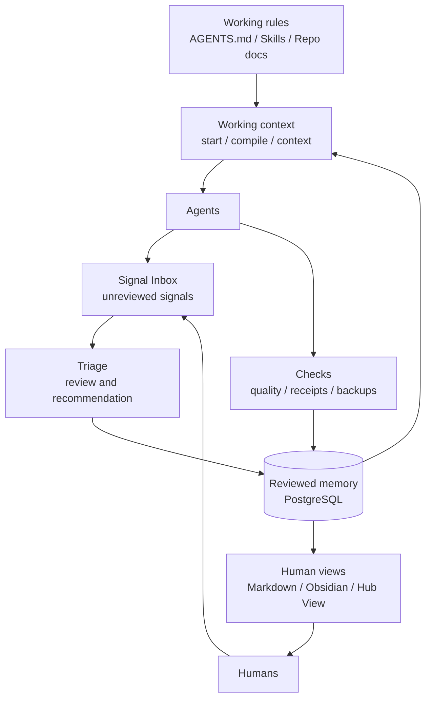

# Agent Data Hub

> verified context for humans and agents

Agent Data Hub is an early local-first technical preview for reviewed project
memory and disciplined agent work.

License: MIT.

It is built for a simple problem: agents often work from scattered chats,
partial context, and stale assumptions. Agent Data Hub gives them a smaller,
reviewable starting point and gives humans a calmer way to inspect what is
actually known.

## What It Is

Agent Data Hub separates three things:

- **Memory**: reviewed project knowledge stored in PostgreSQL.
- **Working context**: the compact brief an agent starts from for one run.
- **Working rules**: repo-local instructions such as `AGENTS.md`, skills, and
  project documents.

Useful signals that are not reviewed yet should stay outside the Hub in a
Signal Inbox until they are triaged.

The Hub stores curated facts, decisions, risks, open questions, reports, and
relations. It can export a human-readable Markdown projection and show the same
state in a small local read-only UI called Hub View.

## What It Is Not

Agent Data Hub is not:

- a raw chat log store
- a secret store
- an autonomous schema generator
- a hosted multi-user SaaS
- a replacement for repo-local working rules

It is a local reviewed context system with operational checks, backups, and
explicit project boundaries.

The automation boundary is intentionally conservative: checks, exports,
receipts, backups, and read-only context can run automatically; triage may make
suggestions; Hub writeback stays reviewed; deployments, credentials,
destructive actions, and external publishing require explicit human approval.

## Public Preview Status

This repository should currently be read as an **early local-first technical
preview**.

What is already real:

- a PostgreSQL-backed memory model
- start/finish wrappers for disciplined agent runs
- quality checks, receipts, and backup verification
- Markdown/Obsidian projection
- a local read-only Hub View

What is still rough:

- some scripts are tuned for the maintainer's own local workflow
- packaging is still intentionally lightweight
- the demo path is narrower than the internal day-to-day path

## Architecture



## Public Quickstart

For a public smoke test, use the dedicated neutral demo path:

1. Create a virtual environment and install the local CLI:

```bash
python3 -m venv .venv
source .venv/bin/activate
pip install -e .
cp .env.example .env
```

For a guided local setup with calm defaults, run:

```bash
agent-hub setup
```

The assistant asks only a few questions, shows the planned local changes, and
writes a small local setup file before you start the demo path.

You can still run the underlying script directly:

```bash
scripts/setup_assistant.sh
```

2. Start the public demo database path:

```bash
scripts/db_start_public_demo.sh
```

3. Run the end-to-end demo smoke:

```bash
scripts/smoke_public_demo.sh
```

4. Start the local read-only review UI:

```bash
scripts/hub_view.sh
```

Hub View is a local review surface, not the operational source of truth.

## Agent Workflow

The normal run rhythm is:

```bash
scripts/agent_start.sh --project <project-slug> --query "<current focus>" --review
# work inside one project boundary
scripts/agent_finish.sh --project <project-slug> --review
```

For a task-specific read-only context pack:

```bash
agent-hub prepare --project <project-slug> --task "review release v0.1.1"
```

`prepare` turns reviewed memory into a concrete working brief for one task. It
does not write memory, import signals, or make decisions. The output includes a
Context Trail that lists included source item counts, IDs, status, task scores,
review status, and inclusion reasons. Drafts may appear in a separate review
section, clearly marked as unconfirmed. `--task` ranks facts, decisions, and
reports with deterministic PostgreSQL full-text search, then fills with recent
reviewed context. Active risks and open questions remain on a safety floor and
are not filtered out by task text.

`prepare` also includes a compact **Known Gaps** section. It can show stale
items, unanswered questions, empty memory types, task blind spots, and pending
drafts. These are read-only labels in the context pack. A stale reviewed item
stays reviewed; there is no silent demotion, re-review, or automatic action.
The default stale threshold is 42 days and can be changed with:

```bash
agent-hub prepare --project <project-slug> --task "review release" --stale-after-days 60
```

Submit only sourced, non-sensitive memory candidates:

```bash
scripts/project_remember.sh \
  --project <project-slug> \
  --type fact \
  --text "Reviewed project memory goes here." \
  --source "non-sensitive source"
```

The wrapper applies the same routing as the CLI. Ordinary candidates become
drafts; sensitive or contradictory candidates require review first.

## Drafts and Review Inbox

New memory candidates are routed before they touch reviewed memory:

- `auto`: reversible evidence such as receipts, audit records, or same-source
  refreshes of an existing reviewed item
- `ask`: money amounts, secret or credential patterns, customer-data hints,
  deletion intent, or contradictions with existing reviewed memory
- `draft`: ordinary unreviewed candidates

Drafts are stored with status `draft` and remain outside reviewed memory until a
human explicitly accepts them:

```bash
agent-hub inbox
agent-hub inbox --accept <draft-id>
agent-hub inbox --reject <draft-id>
```

There is no time-based auto-accept and no silent promotion from draft to
reviewed memory.

If something useful does not fit an existing category, record a structure
question instead of forcing it into the wrong type:

```bash
scripts/project_schema_friction.sh \
  --project <project-slug> \
  --observed "This rule does not belong in durable memory." \
  --why "It may belong in AGENTS.md or a skill manifest." \
  --dry-run
```

## Human Views

Agent Data Hub can project reviewed memory into Markdown for human reading and
Obsidian graph navigation. It can also render the same project set in Hub View.

The human-facing surfaces are for:

- reading
- review
- graph navigation
- notes and handoff inspection

They are not the binding database. PostgreSQL remains the reviewed source of
truth.

## Signal Inbox

Not every useful input belongs in reviewed memory immediately.

Agent Data Hub now documents a small Signal Inbox pattern for:

- X or Twitter research
- Gmail observations
- Hermes or Codex notes
- external links and screenshots

The Signal Inbox is a human-readable wiki folder outside PostgreSQL. Triage
decides whether a signal should be ignored, kept in the wiki, promoted to a
memory candidate, or treated as a skill or policy hint.

Initialize one with:

```bash
scripts/init_signal_inbox.sh --path /path/to/wiki/inbox/signals
```

That initializer now creates only a minimal root by default. Add a first source
file only when a real source needs one:

```bash
scripts/init_signal_inbox.sh --path /path/to/wiki/inbox/signals --scaffold-source x-research
```

## Safety Boundaries

Do not store these in the Hub:

- passwords
- API keys or tokens
- FTP credentials
- private customer data
- raw invoice data
- deployment secrets
- unreviewed claims
- cross-project assumptions

## Startup Paths

This repository now has two deliberately separate startup paths:

- `scripts/db_start_public_demo.sh`: neutral public demo path
- `scripts/db_start.sh`: maintainer local ops path

The public path is the recommended first experience for outside developers.
The maintainer path exists for the operator's own daily work and seeds real
local working data.

## Further Reading

- [Public overview](docs/public/agent-data-hub-overview.md)
- [Public getting started](docs/public/getting-started.md)
- [v0.1.0 release notes](docs/public/v0.1.0-release-notes.md)
- [Announcement pack](docs/public/announcement-pack.md)
- [Agent workflow](docs/agent-workflow.md)
- [Automation boundaries](docs/automation-boundaries.md)
- [Code architecture](docs/code-architecture.md)
- [Schema notes](docs/schema-notes.md)
- [Signal Inbox](docs/signal-inbox.md)
- [Contributing](CONTRIBUTING.md)
- [Security policy](SECURITY.md)
