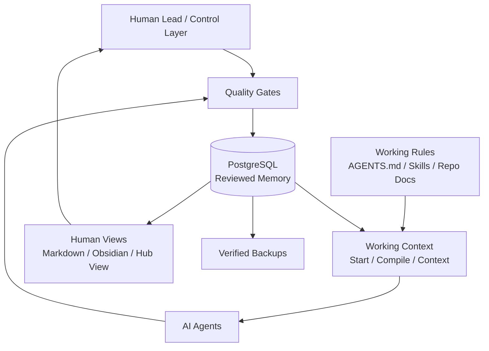

# Agent Data Hub

Verified context for humans and agents.

## Short Version

Agent Data Hub is a controlled context system for humans and AI agents. It keeps
important project knowledge out of disposable chat logs and separates three
things:

- **Memory**: what is durably reviewed and stored in PostgreSQL.
- **Working context**: what applies to the current agent run.
- **Working rules**: how the repo says work should be done.

Humans read and review the same knowledge through Markdown, Obsidian, and Hub
View. Agents start work from compact project context and write back only
curated, non-sensitive memory.

## Why It Exists

Normal chat memory is convenient, but it is often hard to inspect, hard to
correct, and easy to mix across projects. Agent Data Hub uses project contexts,
quality gates, receipts, backups, and relation links to make memory more
trustworthy.

It is not a place for raw chat logs. It is a place for reviewed project memory
and clear working context.

## Core Flow

```bash
scripts/agent_start.sh --project project-a --query "current focus" --review
# agent works inside the selected project context
scripts/agent_finish.sh --project project-a --review --export --backup
scripts/memory_receipt.sh --project project-a --since 24h
```

## Memory Types

- Facts: reviewed statements with source and confidence.
- Decisions: choices with rationale and consequences.
- Risks: known hazards with impact or mitigation.
- Open Questions: unresolved clarification needs.
- Reports: daily summaries, handoffs, audits, and reviews.
- Relations: curated links such as `fact supports decision`.

## Architecture



## Compared With Normal Chat Memory

- Chat memory tends to be implicit; Agent Data Hub is inspectable.
- Chat memory can mix contexts; Agent Data Hub separates project contexts.
- Chat memory often lacks evidence; Agent Data Hub uses sources and receipts.
- Chat memory is hard to back up; Agent Data Hub uses database dumps and checksums.
- Chat memory is often verbose; Agent Data Hub compiles compact working briefs.

## Safety Boundaries

The Hub is for non-sensitive project memory. It should not store passwords,
API keys, tokens, private customer data, raw invoice data, deployment secrets,
or unreviewed claims.

## Human Wiki Projection

The Markdown projection is for reading, review, graph navigation, and human
notes. It is not the primary database. Structured changes flow back only through
controlled import or writeback paths.
